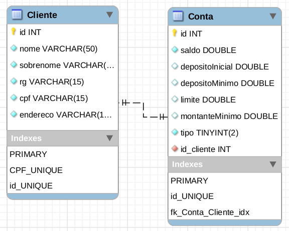

# Trabalho de LPOOII
Projeto de Java Ant utilizando JDK 11

Diagrama entidade relacionamento



### Comandos Git
```
Clonar repositório
$ git clone https://github.com/LeonardoZanotti/lpooII-trabalho.git

Pegar atualizações do remoto
$ git pull

Enviar alterações locais para o remoto
$ git add .
$ git commit -m "mensagem do commit"
$ git push
```