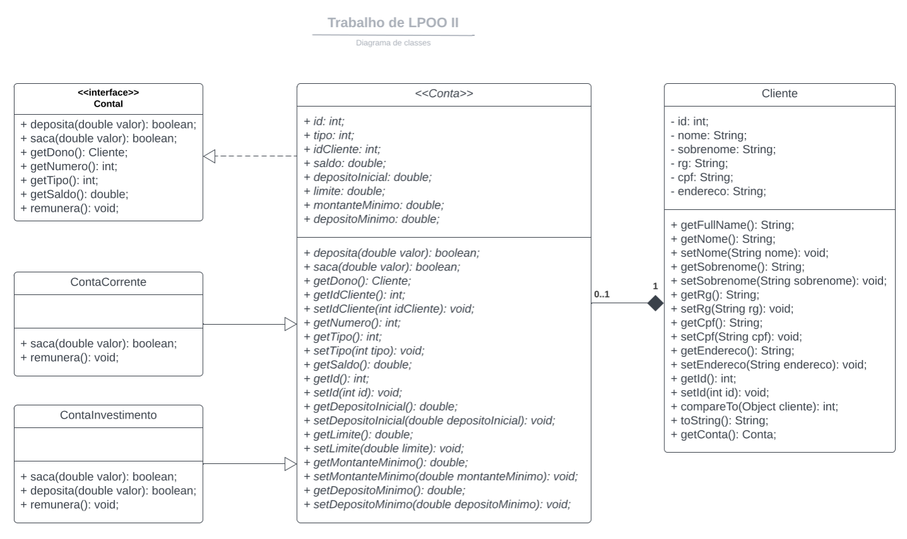

# Trabalho de LPOOII
Projeto de Java Ant utilizando JDK 11

## Diagrama entidade relacionamento


## Diagrama de classes

[](https://lucid.app/lucidchart/77a6fa6e-8116-4a2e-a8d5-0eb877494ed0/edit?beaconFlowId=0525A93CC3DF72A3&invitationId=inv_033d9a59-02fb-4674-80d9-63f7c4802204&page=SkU_GrcNafZS#)

### Comandos Git
```
Clonar repositório
$ git clone https://github.com/LeonardoZanotti/lpooII-trabalho.git

Pegar atualizações do remoto
$ git pull

Enviar alterações locais para o remoto
$ git add .
$ git commit -m "mensagem do commit"
$ git push
```

### Build
```
$ java -jar lpooII_work/dist/lpooII_work.jar
```
